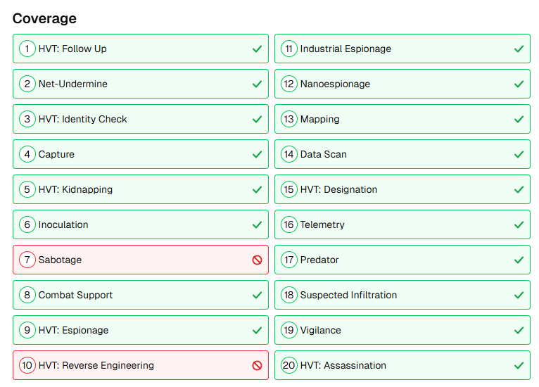

# Infinity the Classifieds — Coverage Icons



A Chrome extension that adds visual pass/fail icons to the Coverage section on [infinitytheclassifieds.com](https://www.infinitytheclassifieds.com) army analysis pages.

## What it does

When you open an army analysis page, each item in the **Coverage** section gets an icon on its right side:

- **Green checkmark** — this scenario is covered by your army list
- **Red circle with a line through it** — this scenario is not covered

---

## How to install

Chrome doesn't install this from the Web Store — you load it directly from the files. It takes about 60 seconds.

### Step 1 — Download the files

Click the green **Code** button on this page, then click **Download ZIP**.

Unzip the downloaded file somewhere you'll remember (e.g. your Desktop or Documents folder). You should see a folder called `coverage-icons` inside it — that's the one you need.

### Step 2 — Open Chrome's extension page

In Chrome, type this in the address bar and press Enter:

```
chrome://extensions/
```

### Step 3 — Turn on Developer Mode

In the top-right corner of that page, flip the **Developer mode** toggle to ON.

### Step 4 — Load the extension

Click the **Load unpacked** button that appears on the left.

A file picker opens. Navigate to the folder you unzipped and select the **`coverage-icons`** folder (not a file inside it — the folder itself).

Click **Select Folder**.

### Step 5 — You're done

Go to any army analysis page on [infinitytheclassifieds.com](https://www.infinitytheclassifieds.com) and scroll down to the **Coverage** section. Each item will have a checkmark or a red icon on its right side.

---

## How to use it

Once installed, restart chrome and then everything is automatic — just open any analysis page and the icons appear. No buttons to click, no settings to configure.

---

## Keeping it up to date

If the extension stops working after a site update, check this page for a newer version and repeat the install steps — just overwrite the old `coverage-icons` folder with the new one, then go to `chrome://extensions/` and click the refresh icon on the extension card.

---

## Questions or problems

Open an issue on this GitHub page and describe what you're seeing.
